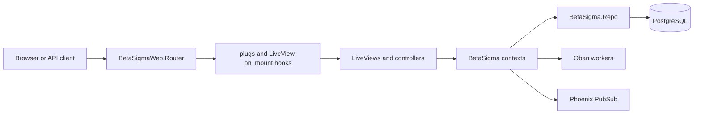

# Architecture

BetaSigma is a Phoenix 1.7 LiveView application backed by Ecto/PostgreSQL. The application module is `BetaSigma.Application`; the web interface is under `BetaSigmaWeb`; persistence runs through `BetaSigma.Repo`.

## Layers



- Router and pipelines: `lib/beta_sigma_web/router.ex` defines browser, API session, authenticated, internal-user, and admin-only entry points.
- Web layer: LiveViews and controllers in `lib/beta_sigma_web/` render pages, handle form events, and call contexts.
- Context layer: modules in `lib/beta_sigma/` own business operations such as `Accounts`, `Projects`, `Chat`, and `Notes`.
- Repo layer: Ecto schemas and migrations define the data model. PostgreSQL is configured in `config/dev.exs`, `config/test.exs`, and production runtime config.
- Background work: Oban runs notification and task reminder workers.
- Real-time updates: Phoenix PubSub is used by contexts such as Chat, Projects, and Notifications so LiveViews can update after mutations.

## Directory Map

```text
lib/beta_sigma/                  Business contexts, schemas, service modules, workers
lib/beta_sigma/accounts/         User and session token schemas
lib/beta_sigma/projects/         Projects, sprints, tasks, assignees, comments
lib/beta_sigma/chat/             Channels, conversations, messages, mentions, reactions
lib/beta_sigma/notes/            Notes schema
lib/beta_sigma/notifications/    In-app notification schema
lib/beta_sigma_web/              Router, endpoint, auth, controllers, LiveViews, components
lib/beta_sigma_web/live/         Workspace and admin LiveViews
priv/repo/migrations/             Database schema history
priv/repo/seeds.exs               Idempotent contributor seed data
assets/                           esbuild, Tailwind, and npm assets
```

## Tech Stack

| Dependency | Purpose |
| --- | --- |
| Phoenix, Phoenix LiveView, Phoenix HTML | HTTP routing, LiveView UI, components |
| Ecto SQL, Postgrex | PostgreSQL persistence |
| Oban | Background jobs and scheduled workers |
| esbuild, Tailwind | Asset compilation |
| Heroicons | UI icons |
| Finch, Req | HTTP clients |
| Bcrypt | Password hashing |
| Gettext, Jason, Telemetry | i18n, JSON, metrics |
| Bandit | Phoenix HTTP adapter |
| Credo | Static analysis |

## Assets

`mix.exs` defines `assets.setup`, `assets.build`, and `assets.deploy`. The asset pipeline is the standard Phoenix esbuild/Tailwind setup with app config in `config/config.exs`; `assets/package.json` also includes `html2canvas` and `sortablejs`.

## Docker

No `Dockerfile` or `docker-compose.yml` is present.
