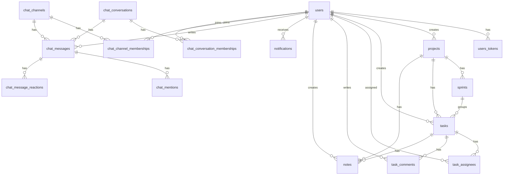

# Data Model

The schema is defined by Ecto migrations in `priv/repo/migrations/` and schemas under `lib/beta_sigma/`.

## Core ER View

## Tables

| Table | Schema | Notes |
| --- | --- | --- |
| `users` | `Accounts.User` | Email identity, role enum, permissions array, hashed password, confirmation timestamp |
| `users_tokens` | `Accounts.UserToken` | Session, email, and reset tokens |
| `projects` | `Projects.Project` | Delivery projects, creator link, budget, status |
| `sprints` | `Projects.Sprint` | Project sprint cadence and date range |
| `tasks` | `Projects.Task` | Project tasks, sprint link, phase/status/priority |
| `task_assignees` | `Projects.TaskAssignee` | Join table for tasks and users |
| `task_comments` | `Projects.TaskComment` | Task discussion |
| `notes` | `Notes.Note` | Personal/shared notes tied to project/task/user |
| `notifications` | `Notifications.Notification` | In-app notification records |
| `chat_channels` | `Chat.Channel` | Public/private channels |
| `chat_channel_memberships` | `Chat.ChannelMembership` | Join table for channels and users, with role and last-read tracking |
| `chat_conversations` | `Chat.Conversation` | Direct-message conversations |
| `chat_conversation_memberships` | `Chat.ConversationMembership` | Join table for conversations and users, with last-read tracking |
| `chat_messages` | `Chat.Message` | Channel/conversation messages, attachments, pin state |
| `chat_mentions` | `Chat.Mention` | `@mention` records per message and mentioned user |
| `chat_message_reactions` | `Chat.MessageReaction` | Emoji reactions per message and user |
| `oban_jobs` | Oban | Background job queue |

## Important Constraints

- `users.email` is unique.
- `users_tokens.context, users_tokens.token` is unique.
- `sprints.project_id, sprints.name` is unique.
- `task_assignees.task_id, task_assignees.user_id` is unique.
- `chat_channels.slug` is unique.
- `chat_channel_memberships.channel_id, chat_channel_memberships.user_id` is unique.
- `chat_conversation_memberships.conversation_id, chat_conversation_memberships.user_id` is unique.
- `chat_message_reactions.message_id, chat_message_reactions.user_id, chat_message_reactions.emoji` is unique.
